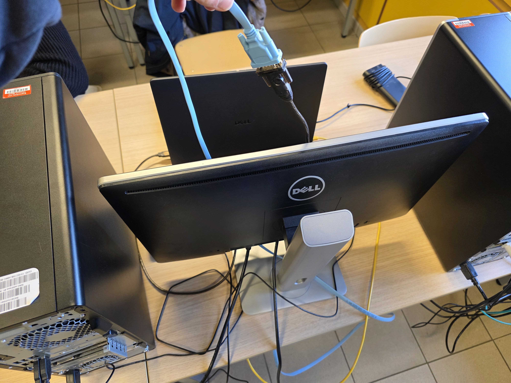
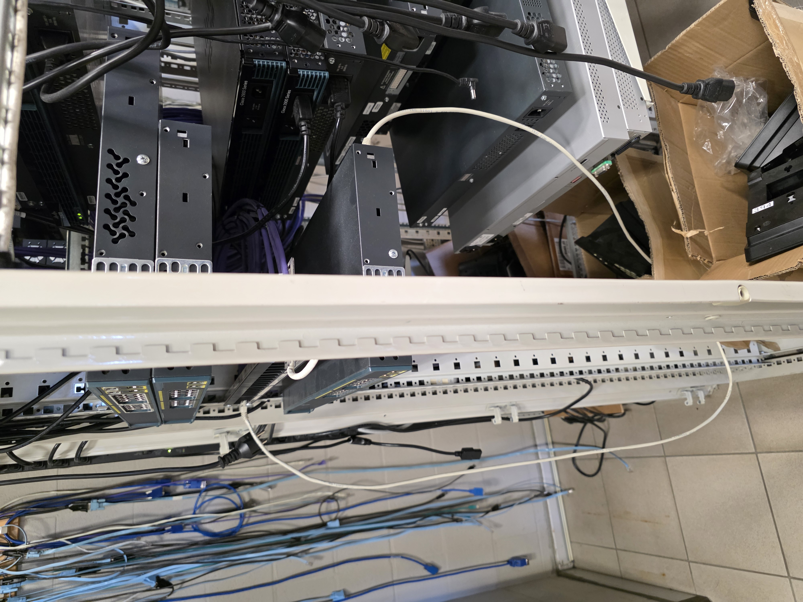
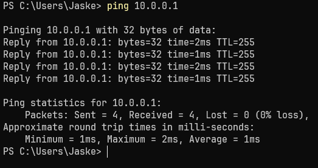

# Lab 2: Introduction to Cisco IOS

## Configuring a Cisco Switch

### Console verbinding

**Connect your computer's serial interface (or USB to serial converter) with the console port of a Cisco switch. Open a terminal program (e.g. PuTTY) on your computer and try to open the Cisco IOS shell.**

**Which cable did you use?**

In Packet Tracer: een consolekabel (lichtblauw, rollover cable). In het echt: een RJ-45-naar-DB9-consolekabel, aangesloten via een USB-naar-serieel adapter.

**Which ports did you use?**

In Packet Tracer: de Console-poort van de switch en de RS232-poort van de PC. In het echt: de Console-poort (RJ-45) van de switch en een seriële COM-poort (of USB-adapter) op de laptop.




**What is the name (COM1, COM5, ...) of the serial port that you used? Where did you find this?**

In Packet Tracer is er geen COM-poortnaam: de terminalsessie wordt rechtstreeks via de virtuele consolekabel in de simulatie geopend. In het echt zoek je de COM-poortnaam op in **Apparaatbeheer** (Windows) → *Poorten (COM en LPT)*. In ons geval was het COM12.

**What is the signature of the prompt you see in your CLI? Which mode are you in?**

```ios
Switch>
```

Dit is de **User EXEC mode**. Vanuit hier kunnen enkel basiscommando's worden uitgevoerd (bv. `show version`, `ping`). Om naar de Privileged EXEC mode te gaan typ je `enable`, waarna de prompt verandert naar `Switch#`.

### Startup config wissen en rebooten

> *Cisco Catalyst devices hebben 2 configuratiebestanden: de **startup-config** in het NVRAM en de **running-config** in het RAM. Bij het opstarten wordt de startup-config gekopieerd naar het RAM. Alle wijzigingen gebeuren in de running-config. Om wijzigingen te bewaren tussen reboots moet je ze kopiëren naar de startup-config. Om te resetten verwijder je de startup-config en herstart je het apparaat.*

**Which commands did you use?**

```ios
Switch# erase startup-config
Switch# reload
```

**How long did it take to reboot your switch?**

~40 seconden in het echt, ~10 seconden in Packet Tracer.

### Hostnaam instellen

**In which mode did you have to change the name of your switch?**

Global Configuration Mode: `Switch(config)#`

**Which command did you use?**

```ios
Switch# configure terminal
Switch(config)# hostname Jasper
```

### Hostnaam gaat verloren na reboot (zonder opslaan)

**Is the name of the switch still the name you set previously?**

Nee, de naam is teruggezet naar de standaardwaarde (`Switch`).

**Can you explain this?**

Alle aanpassingen worden standaard enkel in de running-config opgeslagen, die in het vluchtige RAM-geheugen staat. Bij een reboot wordt het RAM gewist. Omdat de wijzigingen nog niet naar de startup-config (NVRAM) waren gekopieerd, gingen ze verloren.

### Hostnaam opslaan en rebooten

**Which command did you use?**

```ios
Jasper# copy running-config startup-config
```

**Is the name of the switch still the name you set previously after reboot?**

Ja.

### Klok instellen

**Which commands did you use?**

```ios
Jasper# clock set 15:51:00 3 March 2026
Jasper# show clock
```

**What did you use the `?` for?**

Om een lijst op te vragen met alle beschikbare commando's in de huidige modus, of om te zien welke parameters/argumenten je nog moet typen om een specifiek commando af te maken. Voorbeelden:

- `Switch#?` → alle commando's
- `Switch#c?` → alle commando's die beginnen met `c`
- `Switch#clock ?` → het volgende argument van `clock`
- `<cr>` betekent dat het commando compleet is

### Wachtwoorden instellen

> Stel het **console password** in op `cisco` en het **enable password** op `student`. Gebruik altijd `student` of `cisco` als wachtwoord tijdens de labo's.

**Which commands did you use?**

```ios
Jasper# configure terminal
Jasper(config)# enable secret student
Jasper(config)# line console 0
Jasper(config-line)# password cisco
Jasper(config-line)# login
Jasper(config-line)# end
Jasper# copy running-config startup-config
```

> **Nota:** `enable secret` en `enable password` mogen niet tegelijk hetzelfde wachtwoord gebruiken. `enable secret` heeft prioriteit en is geëncrypteerd (MD5).

**When does your terminal ask for these passwords?**

- Het **console password** (`cisco`) wordt gevraagd wanneer je via de terminal (bv. PuTTY) een seriële verbinding maakt met de switch.
- Het **enable password** (`student`) wordt gevraagd wanneer je `enable` typt in de User EXEC mode om naar de Privileged EXEC mode te gaan.

## Accessing Your Switch Over the Network

### IP-adres instellen op VLAN 1

**Which commands did you use?**

```ios
Jasper# configure terminal
Jasper(config)# interface vlan 1
Jasper(config-if)# ip address 10.0.0.1 255.255.255.0
Jasper(config-if)# no shutdown
Jasper(config-if)# end
Jasper# copy running-config startup-config
```

**Which ports are member of VLAN 1?**

Alle fysieke netwerkinterfaces (FastEthernet/GigabitEthernet poorten) zijn standaard lid van VLAN 1, het default VLAN.

### Ping van PC naar switch

Stel een statisch IP-adres in op de PC in hetzelfde subnet (bv. `10.0.0.100/255.255.255.0`). Verbind de ethernet-poort van de PC met een netwerkpoort van de switch.

**Resultaat:** Ping naar `10.0.0.1` werkt.



### Telnet en SSH configureren

> Enable Telnet op de eerste 5 VTY lines (0–4) en SSH op de overige VTY lines (5–15).

**Which commands did you use?**

```ios
Jasper# configure terminal
Jasper(config)# aaa new-model
Jasper(config)# username cisco password 0 cisco
Jasper(config)# ip domain-name lab.local
Jasper(config)# crypto key generate rsa
```

*(Voer `1024` in als key modulus wanneer gevraagd)*

```ios
Jasper(config)# ip ssh version 2
Jasper(config)# ip ssh time-out 60
Jasper(config)# ip ssh authentication-retries 2
Jasper(config)# line vty 0 4
Jasper(config-line)# transport input telnet
Jasper(config-line)# password cisco
Jasper(config-line)# no login
Jasper(config-line)# exit
Jasper(config)# line vty 5 15
Jasper(config-line)# transport input ssh
Jasper(config-line)# exit
Jasper(config)# end
Jasper# copy running-config startup-config
```

> **Troubleshooting: problemen die we tegenkwamen**
>
> **Probleem 1: Cisco 2960 zonder K9-image (c2960-lanbase-mz)**
> Het commando `crypto key generate rsa` gaf `invalid input detected`. Oorzaak: het `lanbase`-image bevat geen cryptografische functies: SSH wordt niet ondersteund. Vereist is een K9-image (bv. `c2960-lanbasek9-mz`). Oplossing: overgeschakeld naar een **Cisco 3560** met K9-image.
>
> **Probleem 2: `aaa new-model` conflicteert met `login`**
> Op de 3560 gaf het commando `login` op de VTY lines de fout: *"AAA is enabled. Command not supported. Use an aaa authentication methodlist."* Oorzaak: zodra `aaa new-model` actief is, vervangt AAA het volledige login-systeem. IOS authenticeert dan automatisch via de lokale gebruikersdatabase (`username cisco`). Het commando `login` is dan niet meer geldig en moet vervangen worden door `no login` (of weggelaten). Bij verbinden via SSH gebruik je username `cisco`, wachtwoord `cisco`.

**Which program did you use to connect to your switch?**

PuTTY

**What settings did you use?**

| Protocol   | Host       | Port   | Connection type   | Credentials                      |
| ---------- |----------- | ------ | ------------------| -------------------------------- |
| Telnet     | 10.0.0.1   | 23     | Other (Telnet)    | password: `cisco`                |
| SSH        | 10.0.0.1   | 22     | SSH               | user: `cisco`, password: `cisco` |

Beide verbindingen werken.

**What is the difference between Telnet and SSH?**

- **Telnet** verstuurt al het netwerkverkeer: inclusief commando's en wachtwoorden: in **plaintext**. In Wireshark is de volledige sessie leesbaar.
- **SSH** (Secure Shell) versleutelt de volledige verbinding. In Wireshark is zichtbaar dat er communicatie plaatsvindt, maar de inhoud is onleesbaar. Dit beschermt tegen packet sniffing.

#### Wireshark / Packet Tracer Simulation Mode: Telnet vs SSH

In Packet Tracer gebruikten we de ingebouwde **Simulation Mode** als vervanging voor Wireshark:

1. Ga naar **Simulation Mode** (rechtsonder, het klokje-icoon)
2. Klik **Edit Filters** → activeer enkel **TCP**
3. Maak vanuit PC0 een Telnet-verbinding naar `10.0.0.1`
4. Klik de gegenereerde paketten aan → bij Telnet zijn commando's en wachtwoorden leesbaar als plaintext in de PDU-details
5. Herhaal met SSH → paketten zijn geëncrypteerd, inhoud is onleesbaar

Dit toont het fundamentele beveiligingsverschil aan tussen beide protocollen.

## Backup the Configuration of the Switch

> Door tftpd64 te draaien op je laptop maak je er een TFTP-server van. Cisco-apparaten kunnen hun configuratiebestand naar een TFTP-server sturen.

**Setup:**

- **In het echt:** Installeer tftpd64, sta poort 69 toe in de firewall, stel de *Current Directory* in op een schrijfbare locatie (bv. Documenten).
- **In Packet Tracer:** Voeg een Server-device toe → **Services** → **TFTP** → zet op **On**. Geef de server IP `10.0.0.200 / 255.255.255.0` en verbind hem met de switch.

**Backup your running configuration to your TFTP server:**

```ios
Jasper# copy running-config tftp
```

```ios
Address or name of remote host []? 10.0.0.200
Destination filename [Jasper-confg]?        ← druk Enter
```

**Use Wireshark to capture and examine the TFTP traffic. Can you find the content of the config file in the capture?**

Ja. Omdat TFTP geen encryptie gebruikt, is de volledige inhoud van het configuratiebestand zichtbaar als plaintext in de packet-details. Dit toont aan dat TFTP onveilig is voor het versturen van gevoelige configuratiedata over een netwerk.

**Packet Tracer Simulation Mode: TFTP:**

1. Ga naar **Simulation Mode** → **Edit Filters** → activeer enkel **UDP**
2. Voer `copy running-config tftp` uit op de switch
3. Er verschijnen UDP-paketten tussen switch (`10.0.0.1`) en TFTP-server (`10.0.0.200`) op **poort 69**
4. Klik een Data-pakket aan → in de PDU-details is de inhoud van het configuratiebestand zichtbaar als plaintext: inclusief hostnaam, wachtwoorden en interface-instellingen

Dit bevestigt dat TFTP-transfers volledig ongeëncrypteerd zijn.

## Demo

*After you did the lab, you should be able to demonstrate the following:*

- Switch name
- Switch clock
- Switch passwords
- Network connectivity between PC0 and Switch0
- Connectivity over Telnet and SSH between PC0 and Switch0 *(Wireshark / Simulation captures)*
- TFTP backup of switch configuration *(Wireshark / Simulation captures)*

### Reset the switch by removing the startup config

```ios
Jasper# erase startup-config
Jasper# reload
```

## Masterconfiguratie: Volledige Setup van Begin tot Einde

Onderstaande commandolijst is de volledige, correcte configuratie uitgevoerd op de switch (Cisco 3560 met K9-image / Packet Tracer), in volgorde, zonder de tussendoor uitgevoerde resets.

### 1. Reset naar fabrieksinstelling

```ios
Switch> enable
Switch# erase startup-config
Switch# reload
```

### 2. Hostnaam instellen

```ios
Switch# configure terminal
Switch(config)# hostname Jasper
Jasper(config)# end
Jasper# copy running-config startup-config
```

### 3. Klok instellen

```ios
Jasper# clock set 15:51:00 3 March 2026
Jasper# show clock
```

### 4. Wachtwoorden instellen

```ios
Jasper# configure terminal
Jasper(config)# enable secret student
Jasper(config)# line console 0
Jasper(config-line)# password cisco
Jasper(config-line)# login
Jasper(config-line)# end
Jasper# copy running-config startup-config
```

### 5. IP-adres instellen op VLAN 1

```ios
Jasper# configure terminal
Jasper(config)# interface vlan 1
Jasper(config-if)# ip address 10.0.0.1 255.255.255.0
Jasper(config-if)# no shutdown
Jasper(config-if)# end
Jasper# copy running-config startup-config
```

### 6. Telnet (VTY 0–4) en SSH (VTY 5–15) configureren

> `aaa new-model` activeert AAA-authenticatie en vervangt het standaard login-systeem. Het commando `login` op een VTY line is daarna niet meer geldig: gebruik `no login`. Authenticatie verloopt automatisch via de lokale gebruikersdatabase (`username cisco`).

```ios
Jasper# configure terminal
Jasper(config)# aaa new-model
Jasper(config)# username cisco password 0 cisco
Jasper(config)# ip domain-name lab.local
Jasper(config)# crypto key generate rsa
```

*(Voer `1024` in als key modulus)*

```ios
Jasper(config)# ip ssh version 2
Jasper(config)# ip ssh time-out 60
Jasper(config)# ip ssh authentication-retries 2
Jasper(config)# line vty 0 4
Jasper(config-line)# transport input telnet
Jasper(config-line)# password cisco
Jasper(config-line)# no login              ! vereist wanneer aaa new-model actief is
Jasper(config-line)# exit
Jasper(config)# line vty 5 15
Jasper(config-line)# transport input ssh
Jasper(config-line)# exit
Jasper(config)# end
Jasper# copy running-config startup-config
```

### 7. TFTP Backup

```ios
Jasper# copy running-config tftp
```

```ios
Address or name of remote host []? 10.0.0.200
Destination filename [Jasper-confg]?        ← druk Enter
```

### 8. Reset (demo / opruimen)

```ios
Jasper# erase startup-config
Jasper# reload
```
